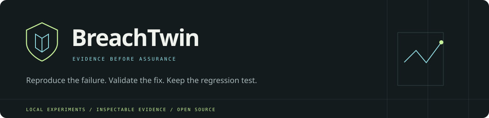
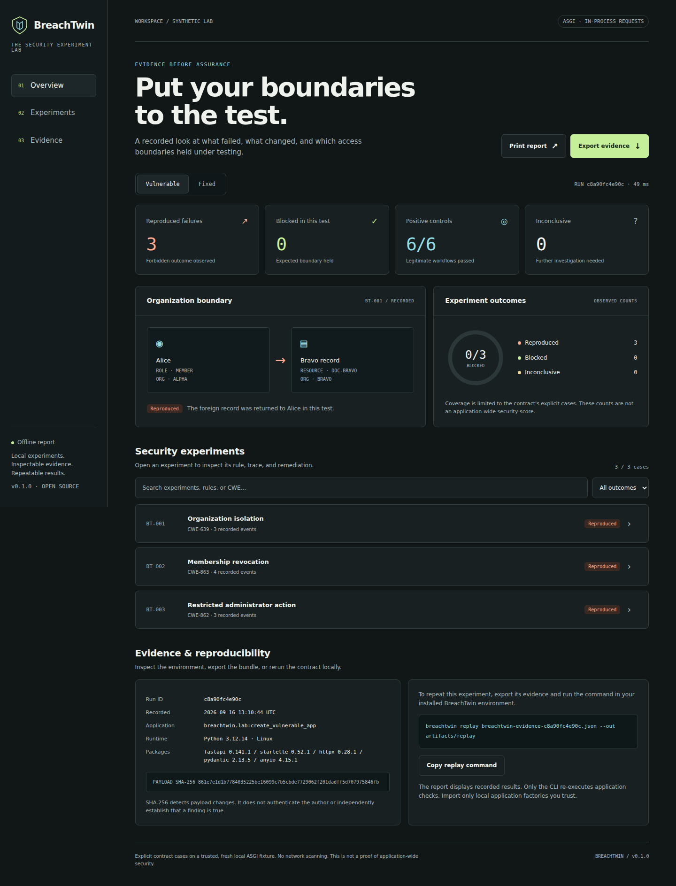

<p align="center"></p>

<p align="center"><strong>Reproduce the failure. Validate the fix. Keep the regression test.</strong></p>
<p align="center">An open-source experiment lab for access-control boundaries in trusted local FastAPI applications.</p>
<p align="center"><a href="#quick-start">Quick start</a> · <a href="docs/contracts.md">Write a contract</a> · <a href="docs/architecture.md">How it works</a> · <a href="docs/troubleshooting.md">Troubleshooting</a> · <a href="CONTRIBUTING.md">Contribute</a></p>

---

**Release: 0.1.0 · Alpha · Python 3.10+ · Apache-2.0**

BreachTwin turns an explicit security rule into a repeatable local experiment. Each experiment includes legitimate-user controls, a request that tests the boundary, and evidence describing what actually happened. The bundled lab demonstrates three seeded failures and their corrected behavior. Exported tests catch the failures when they are reintroduced.

**This release executes contracts you write.** It does not discover unknown vulnerabilities, automatically clone arbitrary applications, generate patches, or provide an OS sandbox. Its applications run as trusted Python code in the current process. These boundaries are part of the product, not hidden behind a risk score.



## What the first release does

| Capability | Implemented behavior |
| --- | --- |
| Local test lab | Fresh in-memory FastAPI fixture for each experiment, with synthetic users and records. |
| Three security experiments | Organization isolation, membership revocation, and an administrator-only action. |
| Explicit contracts | Validated JSON containing actors, preconditions, positive controls, probes, and assertions. |
| Honest outcomes | **Reproduced**, **blocked in this test**, or **inconclusive**. Broken controls never produce a passing case. |
| Before / after comparison | Run identical contracts against the bundled vulnerable and fixed factories. |
| Portable evidence | Versioned JSON with contract, request metadata, assertion outcomes, environment versions, and a SHA-256 checksum. |
| Replay | Verify an evidence bundle, create fresh fixtures, and rerun its contract. |
| Regression export | Generate an executable `unittest` file for local use and CI. |
| Offline report | Responsive HTML with run switching, searchable experiments, trace playback, evidence export, and printing. |
| GitHub integration | A workflow definition for tests and packaging on Linux, Windows, and macOS. Remote CI runs begin after publication. |

No account, AI service, Node.js build, Docker daemon, or API key is required for the bundled demo. Installation downloads Python dependencies. Demo execution and report viewing do not require an Internet connection.

## Quick start

Download and extract the source ZIP, then open a terminal **inside the `breachtwin` folder**. On Linux, macOS, or a Debian/Ubuntu terminal:

```bash
python3 -m venv .venv
source .venv/bin/activate
python -m pip install -e ".[dev]"
breachtwin demo
breachtwin view --open
```

The viewer opens at **http://127.0.0.1:8787**. You can also open `artifacts/demo/report.html` directly in a browser. The file is self-contained; it makes no external requests.

On Windows PowerShell, activation is optional:

```powershell
py -m venv .venv
.\.venv\Scripts\python.exe -m pip install -e ".[dev]"
.\.venv\Scripts\python.exe -m breachtwin demo
.\.venv\Scripts\python.exe -m breachtwin view --open
```

The pre-generated `docs/demo/report.html` is available immediately after extraction. It contains **recorded results**, so opening it does not execute tests.

### Expected demo results

| Contract | Vulnerable fixture | Fixed fixture | Positive controls per fixture |
| --- | --- | --- | --- |
| BT-001 · Organization isolation | Reproduced | Blocked | 2 / 2 passed |
| BT-002 · Membership revocation | Reproduced | Blocked | 2 / 2 passed |
| BT-003 · Restricted administrator action | Reproduced | Blocked | 2 / 2 passed |

These are seeded demonstration cases, not a measurement of detection performance on real-world applications. Re-run them locally to verify the result.

The demo produces:

| File | Purpose |
| --- | --- |
| `artifacts/demo/report.html` | Combined before/after report. |
| `artifacts/demo/vulnerable/evidence.json` | Recorded vulnerable run. |
| `artifacts/demo/fixed/evidence.json` | Recorded fixed run. |
| `artifacts/demo/test_regression.py` | Regression test using the fixed factory. |

### Watch it catch a reintroduced bug

```bash
python artifacts/demo/test_regression.py
```

That test passes on the fixed lab. To deliberately reintroduce the three seeded failures on Linux/macOS:

```bash
BREACHTWIN_FACTORY=breachtwin.lab:create_vulnerable_app python artifacts/demo/test_regression.py
```

The generated test fails with three failing subtests. In PowerShell:

```powershell
$env:BREACHTWIN_FACTORY = "breachtwin.lab:create_vulnerable_app"
.\.venv\Scripts\python.exe artifacts/demo/test_regression.py
Remove-Item Env:BREACHTWIN_FACTORY
```

## Command reference

| Command | Purpose |
| --- | --- |
| `breachtwin demo --out artifacts/demo` | Execute vulnerable and fixed demo fixtures and export a regression test. |
| `breachtwin init --out breachtwin.json` | Create a starter contract; refuses to overwrite an existing file. |
| `breachtwin validate breachtwin.json` | Check structure without importing an application. |
| `breachtwin check --contract breachtwin.json --factory module:create_app` | Run your contract against an explicitly trusted local app factory. |
| `breachtwin verify artifacts/demo/fixed/evidence.json` | Verify evidence structure and checksum without executing an app. |
| `breachtwin replay artifacts/demo/fixed/evidence.json` | Rerun the recorded contract and compare verdicts and environment metadata. |
| `breachtwin export-test artifacts/demo/fixed/evidence.json --out test_security.py` | Write a regression test. |
| `breachtwin schema` | Print the contract JSON Schema. |
| `breachtwin view artifacts/demo/report.html --port 8787` | Serve one saved report on loopback; no file browsing or test execution. |

For `check` and `replay`, exit codes are **0** = all cases blocked with passing controls; **1** = at least one reproduced failure, without inconclusive cases; **2** = incomplete/invalid assessment or at least one inconclusive case. Code 2 takes precedence over code 1; inspect evidence for all findings. Interrupted commands return 130. `demo` returns 0 only when all seeded failures reproduce and all corresponding fixed cases are blocked.

## Connect your own application

1. Create a trusted Python factory that constructs a fresh application and fresh synthetic data. Make it importable in the same environment as BreachTwin.
2. Start with `breachtwin init`. Replace the sample actors, routes, assertions, and security rules with your application's contract.
3. Run `breachtwin validate breachtwin.json` before executing the app.
4. Run `breachtwin check --contract breachtwin.json --factory your_package.fixtures:create_app`.
5. Inspect inconclusive cases, confirm positive controls, and export a regression test.

The runner uses FastAPI's ASGI test client and runs startup/shutdown lifecycle hooks for each experiment. A factory reference is an explicit code-execution decision. It must return fresh state; clearing a production database is never an appropriate fixture reset. The runner itself has no URL-scanning mode.

See [the contract guide](docs/contracts.md) for the complete schema, credential references, outcome semantics, and a custom integration example. See [architecture](docs/architecture.md) for trust boundaries and evidence limitations.

## Android and platform support

The HTML report is designed for mobile browsers. The engine is tested locally on Linux with Python 3.12; the included CI matrix targets Python 3.10, 3.12, and 3.13 on Linux, Windows, and macOS, but those remote jobs have not run before repository publication.

For an Android-first workflow, run the engine in a Debian/Ubuntu terminal or a remote development machine and download the HTML report to your phone. Native Termux installation is **not verified**; `pydantic-core` may require a Rust toolchain when a compatible wheel is unavailable. No Rollup or native Node modules are involved.

## Project map

| Path | Responsibility |
| --- | --- |
| `src/breachtwin/contract.py` | Strict contract validation. |
| `src/breachtwin/engine.py` | Fixture lifecycle, requests, assertions, and verdicts. |
| `src/breachtwin/lab.py` | Synthetic vulnerable/fixed factories. |
| `src/breachtwin/evidence.py` | Evidence integrity, serialization, and regression export. |
| `src/breachtwin/report.py` | Safe embedding of evidence into standalone HTML. |
| `src/breachtwin/assets/` | Offline report template and bundled example contract. |
| `src/breachtwin/cli.py` | Commands, exit codes, and read-only report viewer. |
| `examples/` | Starter contract and integration factory. |
| `tests/` | Behavioral, failure-mode, evidence, and CLI tests. |
| `docs/` | Architecture, contracts, troubleshooting, and a recorded demo. |
| `.github/workflows/ci.yml` | Cross-platform verification and package build. |

## Development

```bash
python -m pip install -e ".[dev]"
python -m pytest -q
python -m build
```

For the exact dependencies used in the recorded demo, install `requirements-tested.txt` first, then install the project. It is a reproducibility snapshot, not a promise of permanent compatibility or the latest security updates. Review dependency updates and rerun the suite when maintaining the project. A Starlette `<1` constraint keeps this release on the tested HTTPX TestClient integration.

See [VALIDATION.md](docs/validation.md) for what was actually exercised in the initial release.

## Roadmap

| Stage | Work | State |
| --- | --- | --- |
| 0.1 | Explicit access-control contracts, local demo, evidence, replay, regression export | Implemented |
| Next | Per-actor cookie sessions, richer assertions, fixture adapters, and timeout isolation | Planned |
| Later | Compare user-supplied candidate fixes across the same contract set | Planned |
| Research | Assisted contract generation, multi-service fixtures, and connected weakness analysis | Exploratory |

Contributions should include a reproducible case, a corrected case, and a test that challenges a plausible false conclusion. Read [CONTRIBUTING.md](CONTRIBUTING.md), [SECURITY.md](SECURITY.md), and [the code of conduct](CODE_OF_CONDUCT.md).

## License and acknowledgements

Copyright 2026 Rocky and BreachTwin contributors. Licensed under [Apache-2.0](LICENSE).

Built on [FastAPI's testing interface](https://fastapi.tiangolo.com/tutorial/testing/), [Starlette TestClient](https://www.starlette.dev/testclient/), [HTTPX](https://www.python-httpx.org/advanced/transports/), and [Pydantic](https://docs.pydantic.dev/latest/). Weakness identifiers refer to the [MITRE CWE catalog](https://cwe.mitre.org/). BreachTwin is an independent project; no affiliation or endorsement is implied.
